# DemurrageOS — Architecture & System Flow Specification

> This document turns the four implementation plans into one architecture reference. It focuses on boundaries, data flow, runtime flow, event flow, asynchronous processing, security boundaries, and failure behavior.
>
> The diagrams use Mermaid where possible so the document can serve as an engineering design reference.

---

# 1. Architecture at a Glance

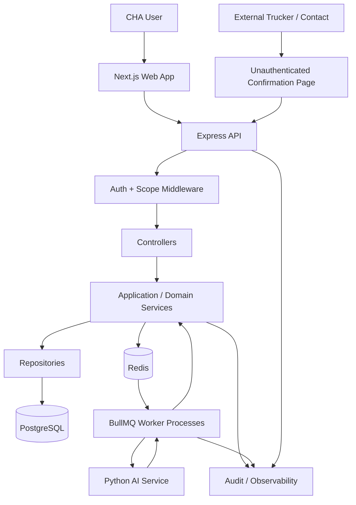

## Core rule

```text
AI is advisory.
Express is authoritative.
PostgreSQL is the source of truth.
Redis/BullMQ is execution infrastructure.
Next.js is the operational interface.
```

---

# 2. Logical Architecture

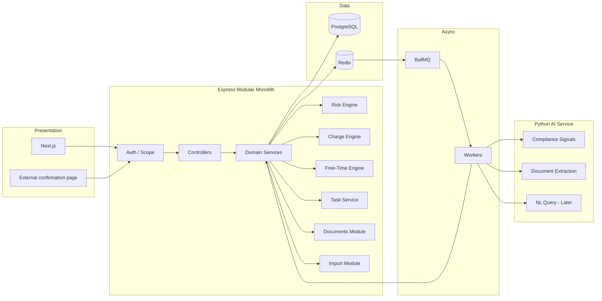

---

# 3. Runtime Deployment Architecture

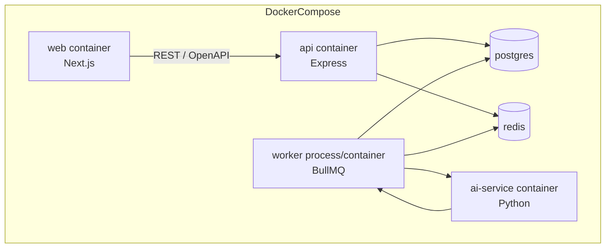

The platform plan specifies the API and worker as separate processes/commands while sharing application/domain code. They share code, but not responsibilities.

---

# 4. Backend Request Flow

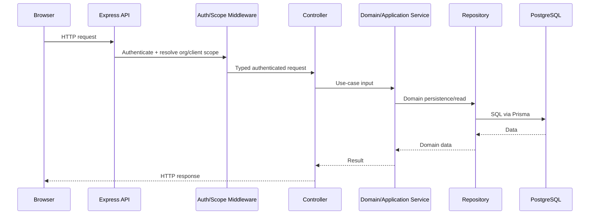

## Boundary rule

Never:

```text
route → Prisma
controller → Prisma
worker → duplicated business logic
```

Always:

```text
route
→ middleware
→ controller
→ service
→ repository
→ database
```

---

# 5. Worker Flow

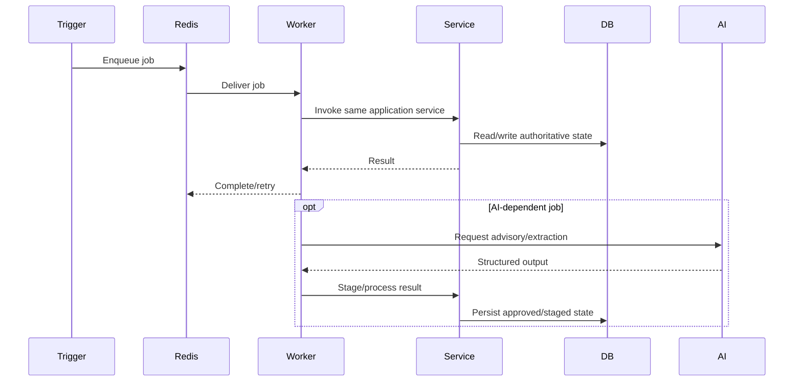

---

# 6. Event-Driven Operational Flow

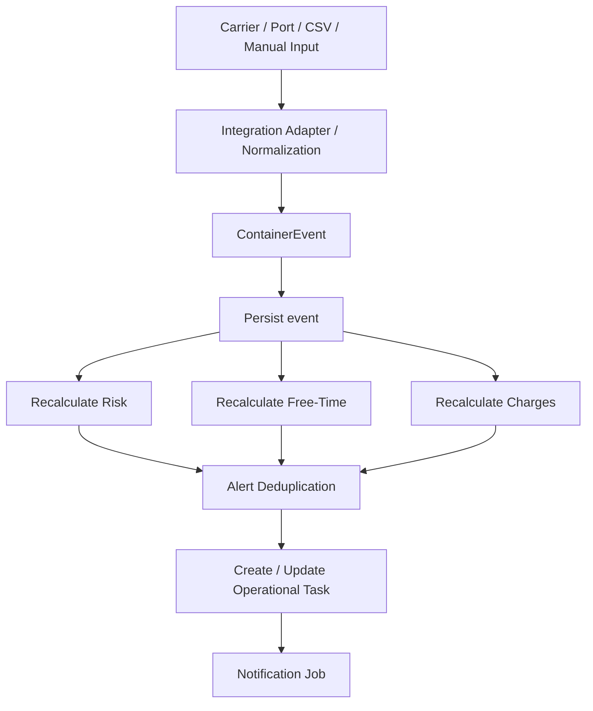

The exact transaction/outbox semantics need to be finalized before production. The architecture should not assume that an external event can simply be inserted twice without consequence.

---

# 7. Container State / Event Flow

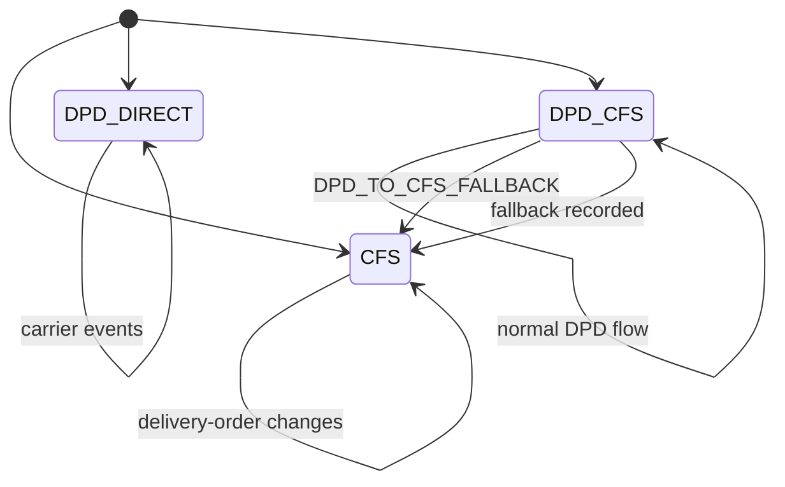

Important: `DPD_TO_CFS_FALLBACK` should be preserved as a historical event. It should not be represented only as a current enum value.

---

# 8. Financial Calculation Flow

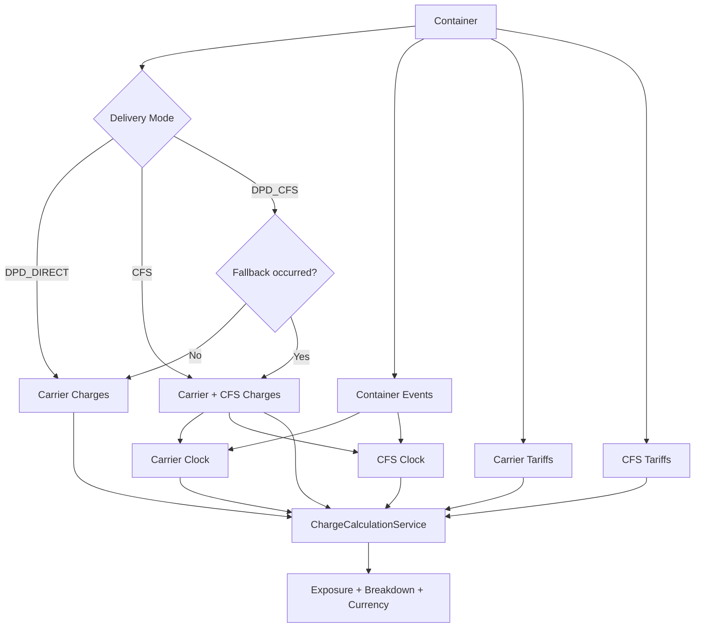

## Two-clock model

```text
Carrier demurrage/detention
    starts from original discharge basis

CFS ground rent
    starts from CFS_GATE_IN after CFS involvement
```

This is a critical domain invariant.

---

# 9. Charge Breakdown

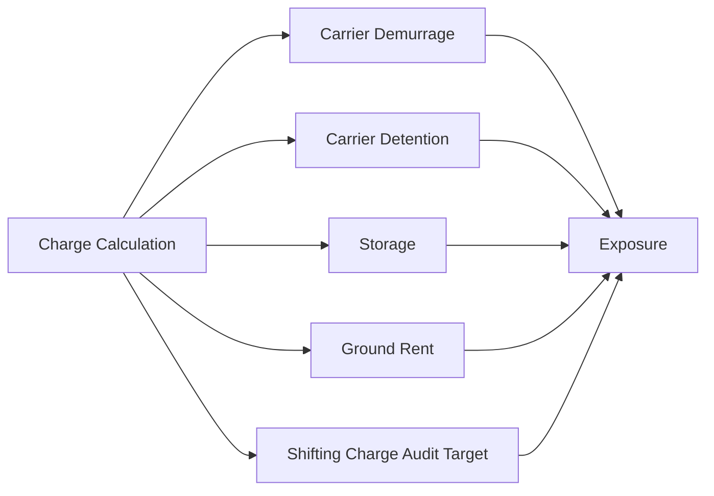

The UI should preserve the breakdown rather than showing only a total.

Example conceptual output:

```text
Carrier demurrage      ₹25,000
CFS ground rent        ₹18,000
Other                  ₹...
-------------------------------
Current exposure       ₹...
Projected exposure     ₹...
```

---

# 10. Risk Architecture

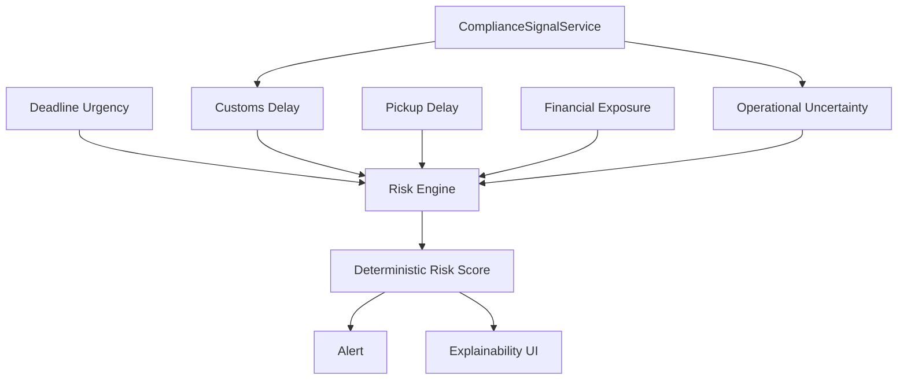

The AI layer does not own the final risk score.

---

# 11. Compliance Signal Flow

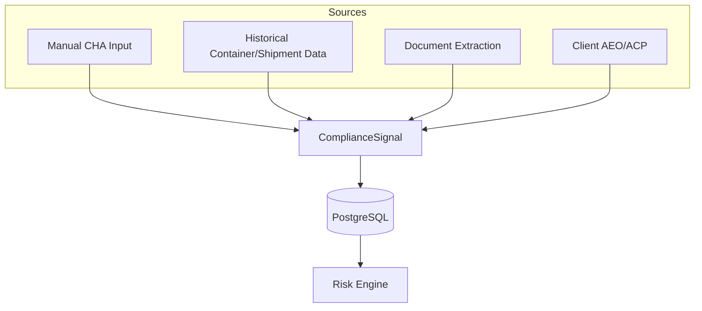

v1 signals:

```text
DOC_COMPLETENESS
HS_CODE_NOVELTY
AEO_ACP_STATUS
VALUATION_CONSISTENCY
```

---

# 12. AI Service Boundary

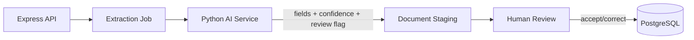

## Forbidden flow

```text
AI
 ↓
PostgreSQL authoritative record
```

## Correct flow

```text
AI
 ↓
structured suggestion
 ↓
Express staging
 ↓
human confirmation
 ↓
authoritative record
```

---

# 13. Document Extraction Sequence

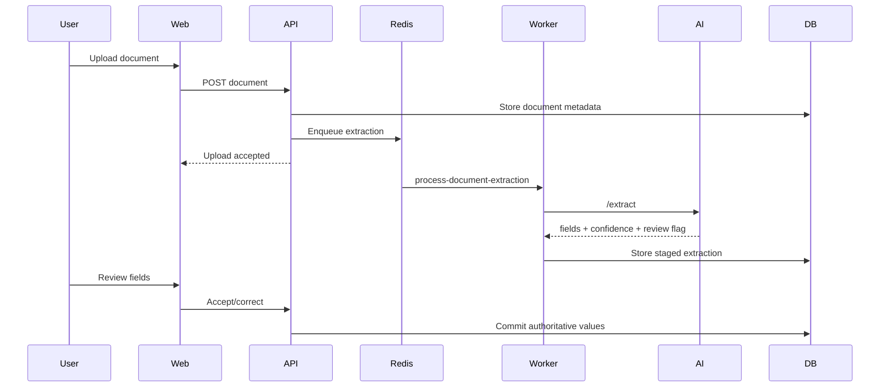

---

# 14. External Task Confirmation Flow

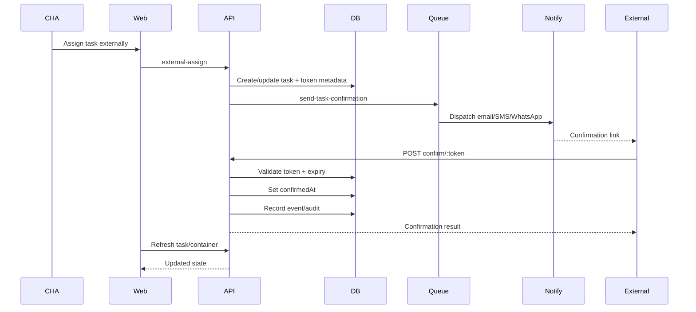

---

# 15. External Token Security Flow

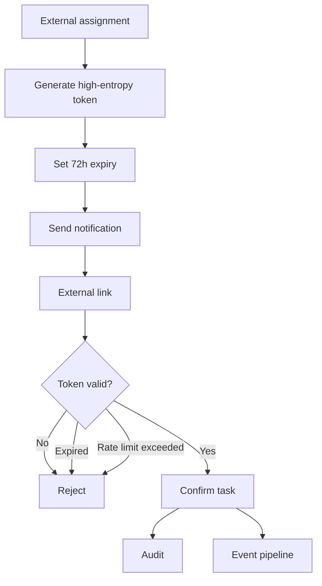

The exact token storage strategy should be finalized. Prefer storing a hash of the token rather than a reusable plaintext token where practical.

---

# 16. Client Scoping Flow

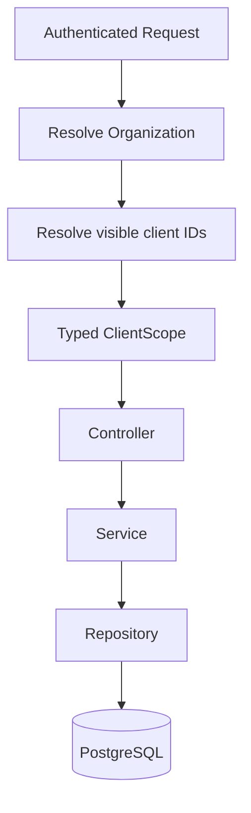

## Required invariant

A user cannot retrieve a container merely because they know its UUID.

The request must satisfy:

```text
container.organizationId == user.organizationId
AND
container.clientId ∈ user.visibleClientIds
```

---

# 17. CSV Import Flow

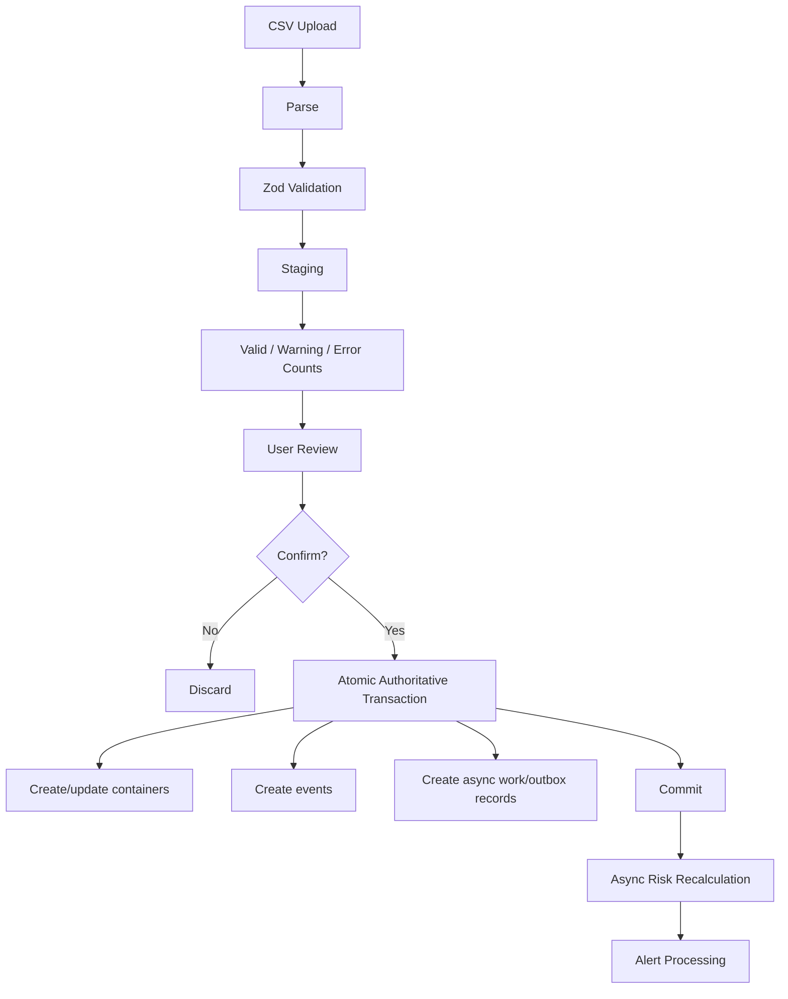

Recommended architectural interpretation:

```text
Database transaction
    authoritative data only

After commit
    asynchronous recalculation
```

This keeps database transactions short.

---

# 18. Data Flow from Import to Risk

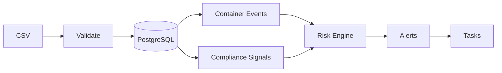

---

# 19. API Contract Flow

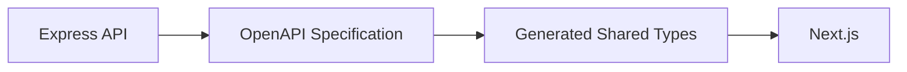

The API contract should be the single source for frontend DTO typing.

---

# 20. Frontend State Flow

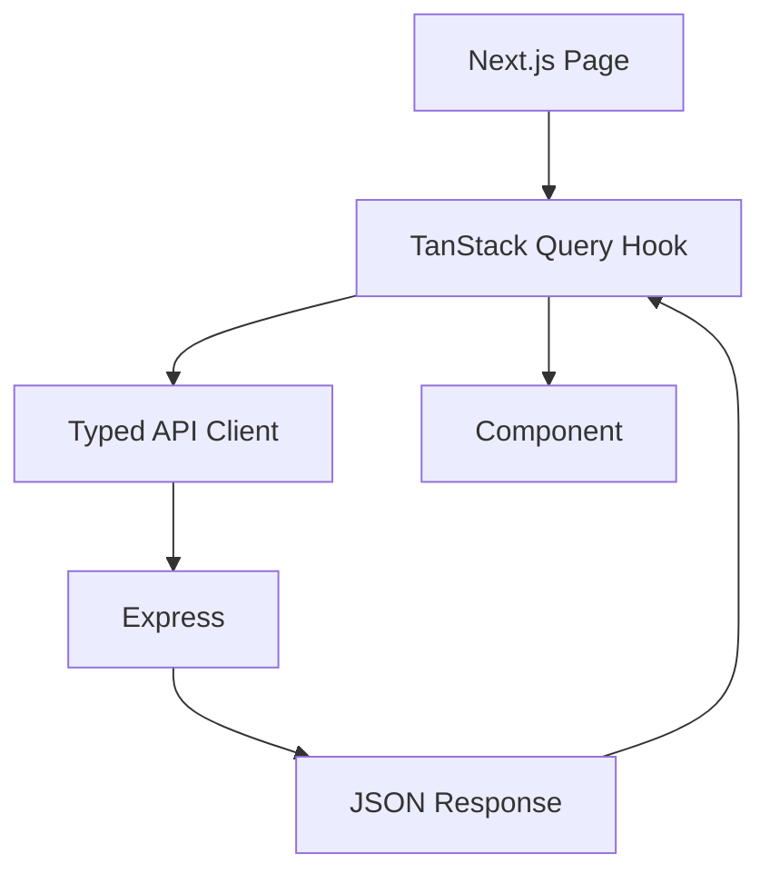

No component-level raw `fetch`.

---

# 21. Frontend Information Architecture

```mermaid
flowchart TD
    APP[CHA Organization]
    APP --> SWITCHER[Client Switcher]

    SWITCHER --> ALL[All Clients]
    SWITCHER --> A[Client A]
    SWITCHER --> B[Client B]
    SWITCHER --> C[Client C]

    ALL --> DASH[Dashboard]
    A --> DASH
    B --> DASH
    C --> DASH

    DASH --> CONTAINERS[Containers]
    DASH --> ALERTS[Alerts]
    DASH --> TASKS[Tasks]
    DASH --> ANALYTICS[Analytics]
```

---

# 22. Container Detail Architecture

```mermaid
flowchart TD
    DETAIL[Container Detail]
    DETAIL --> SUMMARY[Container Summary]
    DETAIL --> MODE[Delivery Mode Badge]
    DETAIL --> TIMELINE[Event Timeline]
    DETAIL --> CHARGES[Charge Breakdown]
    DETAIL --> RISK[Risk Explainability]
    DETAIL --> DOCS[Document Panel]
    DETAIL --> TASKS[Tasks]

    TIMELINE --> FALLBACK{Fallback?}
    FALLBACK -->|Yes| MODE
    FALLBACK -->|Yes| CHARGES
    FALLBACK -->|Yes| RISK
```

---

# 23. Full End-to-End Operational Flow

```mermaid
flowchart TB
    INPUT[Carrier / Port / CSV / Manual Input]
        --> EVENT[Normalized Event]
    EVENT --> DB[(PostgreSQL)]

    DB --> FREE[Free-Time Engine]
    DB --> CHARGE[Charge Engine]
    DB --> SIGNAL[Compliance Signals]
    SIGNAL --> RISK[Risk Engine]
    FREE --> RISK
    CHARGE --> RISK

    RISK --> ALERT[Alert Deduplication]
    ALERT --> TASK[Operational Task]

    TASK --> INTERNAL[Internal Assignee]
    TASK --> EXTERNAL[External Contact]

    EXTERNAL --> TOKEN[Confirmation Token]
    TOKEN --> CONFIRM[External Confirmation]
    CONFIRM --> EVENT2[Status Event]

    EVENT2 --> DB

    DOC[Uploaded Document] --> EXTRACT[AI Extraction]
    EXTRACT --> REVIEW[Human Review]
    REVIEW --> DB
    DB --> SIGNAL
```

---

# 24. Failure Architecture

## AI unavailable

```text
Document upload
 ↓
job queued
 ↓
AI unavailable
 ↓
retry/backoff
 ↓
document remains unprocessed
```

The deterministic system continues operating.

## Redis unavailable

Expected behavior must be explicitly decided.

Recommended:

```text
synchronous CRUD remains available where possible
async work becomes delayed
alerts/jobs do not silently disappear
```

This implies durable enqueue/outbox semantics should be considered.

## Database unavailable

```text
API request
 ↓
DB failure
 ↓
structured 5xx
 ↓
request ID
 ↓
Sentry/log
```

Do not partially report a successful financial mutation.

## Worker failure

```text
job
 ↓
worker crash
 ↓
retry
 ↓
backoff
 ↓
dead-letter/failed state
 ↓
operator visibility
```

---

# 25. Idempotency Architecture

This is a major missing cross-cutting contract in the source plans.

The following should be idempotent:

- event ingestion;
- CSV import confirmation;
- risk recalculation;
- charge recalculation;
- notifications;
- document extraction jobs;
- external confirmation.

Conceptually:

```mermaid
flowchart LR
    JOB[Job/Event]
        --> KEY[Idempotency Key]
    KEY --> CHECK{Already processed?}
    CHECK -->|Yes| RETURN[Return existing result]
    CHECK -->|No| EXEC[Execute]
    EXEC --> RECORD[Record completion]
```

Without this, retries can become duplicate financial or operational actions.

---

# 26. Transaction Boundary Architecture

Recommended pattern:

```text
BEGIN
  authoritative domain writes
  event/outbox record
COMMIT

then:

queue asynchronous processing
```

Avoid:

```text
BEGIN
  database writes
  call AI
  call external notification provider
  calculate everything
COMMIT
```

That would create long, fragile transactions.

---

# 27. Suggested Outbox Pattern

The four plans mention Redis/BullMQ but do not define a durable handoff between PostgreSQL transactions and queue publication.

A robust production pattern is:

```mermaid
flowchart TD
    TX[DB Transaction]
        --> DATA[Domain Data]
    TX --> OUTBOX[Outbox Event]
    TX --> COMMIT[Commit]

    COMMIT --> PUBLISH[Outbox Publisher]
    PUBLISH --> REDIS[Redis/BullMQ]
    REDIS --> WORKER[Worker]
```

This prevents the classic failure:

```text
DB commit succeeds
queue publish fails
→ event exists but async work never runs
```

Whether this is needed for v1 depends on reliability requirements, but it should be an explicit decision rather than an accidental omission.

---

# 28. Security Boundary Map

```mermaid
flowchart TB
    USER[Authenticated CHA User]
    USER --> SESSION[Session/Auth]
    SESSION --> ORG[Organization Scope]
    ORG --> CLIENT[Client Scope]
    CLIENT --> RESOURCE[Domain Resource]

    EXT[External Contact]
    EXT --> TOKEN[High Entropy Token]
    TOKEN --> LIMITED[Single-purpose task endpoint]
    LIMITED --> TASK[Only permitted task action]
```

External users must not inherit authenticated internal API capabilities.

---

# 29. Document Security Boundary

```mermaid
flowchart LR
    USER[Authorized User]
        --> API[Express]
    API --> AUTHZ[Org/Client Authorization]
    AUTHZ --> FILE[Private Document Storage]
    FILE --> AI[Controlled Extraction]
    AI --> STAGE[Staged Output]
    STAGE --> HUMAN[Human Review]
```

Do not expose raw document URLs broadly if documents contain sensitive trade/commercial data.

---

# 30. Observability Flow

```mermaid
flowchart LR
    REQUEST[HTTP Request]
        --> RID[Request ID]
    RID --> LOG[Pino Logs]
    RID --> SENTRY[Sentry]
    RID --> AUDIT[Audit Log]

    JOB[Background Job]
        --> JID[Job ID]
    JID --> LOG
    JID --> SENTRY
    JID --> AUDIT

    CALC[Charge/Risk Calculation]
        --> LOG
        --> AUDIT
```

For financial calculations, log enough structured metadata to reconstruct why a number was produced without logging secrets or unnecessary sensitive document contents.

---

# 31. Financial Traceability Flow

```mermaid
flowchart TD
    EXPOSURE[Exposure Number]
        --> EVENTS[Input Events]
    EXPOSURE --> TARIFF[Tariff Version]
    EXPOSURE --> MODE[Delivery Mode]
    EXPOSURE --> CLOCKS[Free-Time Clocks]
    EXPOSURE --> ADJUST[Manual Adjustments]
    EXPOSURE --> CALCVER[Calculation Version]

    EVENTS --> RECON[Reproducible Calculation]
    TARIFF --> RECON
    MODE --> RECON
    CLOCKS --> RECON
    ADJUST --> RECON
    CALCVER --> RECON
```

This is necessary if the product is ever used to dispute or reconcile a charge.

---

# 32. Module Dependency Architecture

```mermaid
flowchart TD
    AUTH[Auth]
    ORG[Organizations]
    CLIENT[Clients]
    CONTAINER[Containers]
    SHIPMENT[Shipments]
    PORT[Ports]
    CFS[CFS]
    CARRIER[Carriers]
    CUSTOMS[Customs]
    TARIFF[Tariffs]
    CHARGE[Charges]
    FREE[Free-Time]
    RISK[Risk]
    SIGNAL[Compliance Signals]
    ALERT[Alerts]
    TASK[Tasks]
    DOC[Documents]
    IMPORT[Imports]
    ANALYTICS[Analytics]
    AUDIT[Audit]

    AUTH --> ORG
    ORG --> CLIENT
    CLIENT --> CONTAINER
    SHIPMENT --> CONTAINER
    PORT --> CFS
    CFS --> TARIFF
    CARRIER --> TARIFF
    CONTAINER --> CHARGE
    TARIFF --> CHARGE
    CONTAINER --> FREE
    CFS --> FREE
    SIGNAL --> RISK
    CONTAINER --> RISK
    CHARGE --> RISK
    FREE --> RISK
    RISK --> ALERT
    ALERT --> TASK
    CONTAINER --> DOC
    CONTAINER --> IMPORT
    CONTAINER --> ANALYTICS
    CONTAINER --> AUDIT
```

The actual implementation should preserve public module interfaces and prevent direct access to private repositories across modules.

---

# 33. Recommended Build Dependency Graph

```mermaid
flowchart TD
    A[Architecture Freeze]
    B[Monorepo + Docker]
    C[Auth + Organization]
    D[Client + Scope]
    E[Core Entities]
    F[Events]
    G[Read-only UI]
    H[Tariffs]
    I[Charge Engine]
    J[Free-Time Engine]
    K[Risk Engine]
    L[Alerts]
    M[CSV Import]
    N[Internal Tasks]
    O[External Handoff]
    P[Manual Compliance Signals]
    Q[Historical Signals]
    R[Document Extraction]
    S[Analytics]
    T[NL Query]

    A --> B
    B --> C
    C --> D
    D --> E
    E --> F
    E --> G
    F --> H
    H --> I
    F --> J
    I --> K
    J --> K
    P --> K
    K --> L
    L --> N
    N --> O
    M --> F
    Q --> P
    R --> P
    S --> K
    T --> S
```

---

# 34. Critical Architecture Decisions Still Required

These should become ADRs (Architecture Decision Records).

## ADR-001 — Money representation

Decide:

```text
Decimal
or
integer minor units
```

and define rounding.

## ADR-002 — Tariff versioning

Decide:

```text
effective_from
effective_to
version
```

and behavior when historical calculations are reopened.

## ADR-003 — Event idempotency

Define a unique event identity.

## ADR-004 — Queue durability

Decide whether BullMQ alone is enough or whether PostgreSQL outbox is required.

## ADR-005 — File storage

Specify the object store and authorization mechanism.

## ADR-006 — Token storage

Define hashing, expiration, resend, revocation, replay.

## ADR-007 — RBAC

Define the exact roles and permissions.

## ADR-008 — Timezone

Define whether operational timestamps are:

```text
UTC in storage
+
explicit location timezone for business calculations
```

## ADR-009 — API pagination

Define list endpoint pagination before data volume grows.

## ADR-010 — AI provenance

Store:

```text
model/version
prompt/extraction schema version
confidence
timestamp
human correction
```

where appropriate.

---

# 35. Architecture Anti-Patterns

## Anti-pattern 1

```text
Express route
 ↓
Prisma
```

Reject.

## Anti-pattern 2

```text
BullMQ worker
 ↓
own charge calculation
```

Reject.

## Anti-pattern 3

```text
AI
 ↓
UPDATE containers
```

Reject.

## Anti-pattern 4

```text
Frontend
 ↓
client_id filter
 ↓
backend trusts it
```

Reject. The server must determine authorized scope.

## Anti-pattern 5

```text
DPD fallback
 ↓
overwrite mode
 ↓
lose transition history
```

Reject.

## Anti-pattern 6

```text
retry notification
 ↓
send duplicate confirmations
```

Reject unless explicitly deduplicated.

## Anti-pattern 7

```text
random float money calculations
```

Reject.

---

# 36. Final Architecture

The intended system should ultimately behave like this:

```text
                        ┌─────────────────────────┐
                        │       CHA USER          │
                        └────────────┬────────────┘
                                     │
                                     ▼
                        ┌─────────────────────────┐
                        │       NEXT.JS WEB       │
                        │ client switcher         │
                        │ dashboard               │
                        │ containers              │
                        │ alerts/tasks             │
                        │ documents               │
                        └────────────┬────────────┘
                                     │
                              REST / OpenAPI
                                     │
                                     ▼
             ┌──────────────────────────────────────────┐
             │              EXPRESS API                  │
             │                                          │
             │ auth → scope → controller → service      │
             │                         │                 │
             │        ┌────────────────┼──────────────┐  │
             │        │                │              │  │
             │      Risk            Charges        Tasks │
             │        │                │              │  │
             │      Free-time       Tariffs       Handoff│
             │        │                │              │  │
             └────────┼────────────────┼──────────────┼──┘
                      │                │              │
                      └────────────────┼──────────────┘
                                       │
                                       ▼
                              ┌────────────────┐
                              │  PostgreSQL    │
                              │ SOURCE OF TRUTH│
                              └───────┬────────┘
                                      │
                         ┌────────────┴────────────┐
                         │                         │
                         ▼                         ▼
                     Redis/BullMQ              Audit/Logs
                         │
                         ▼
                      Workers
                         │
             ┌───────────┴─────────────┐
             │                         │
             ▼                         ▼
        Python AI Service        External Notify
             │
       ┌─────┴──────────┐
       │                │
  Compliance        Extraction
    Signals
       │                │
       └───────┬────────┘
               ▼
       Advisory/staged output
               │
               ▼
        Express + Human Review
               │
               ▼
        PostgreSQL truth
```

# 37. Architectural Success Criteria

The architecture is successful when all of the following are true:

- a CHA can operate multiple clients from one organization;
- every tenant/client access is enforced server-side;
- container events are normalized and auditable;
- DPD/CFS transitions are historically represented;
- carrier and CFS charges can be calculated independently;
- two clocks can coexist correctly;
- risk remains deterministic;
- AI can improve signals without becoming mandatory;
- document extraction cannot silently corrupt authoritative state;
- an external trucker can complete one task without creating an account;
- retries do not create duplicate financial or operational side effects;
- every important financial number can be reconstructed;
- the system remains operational if the AI service is unavailable;
- v1 does not become a collection of disconnected AI demos.

